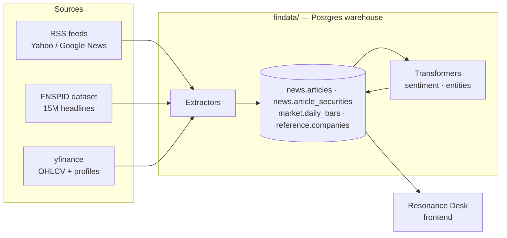

# Financial Tools — the Resonance Desk data engine

The backend financial data warehouse that powers **[Resonance Desk](https://github.com/Steeveyboy/resonance-desk)**, a multi-agent market-intelligence app. That repo is the frontend (Streamlit + LLM agents); this repo is the engine underneath it — a Postgres warehouse that **backfills** and **continuously updates**:

- **Timeseries market pricing** — daily OHLCV via yfinance
- **Timeseries financial news** — live RSS feeds + the 15M-headline FNSPID historical dataset, linked to tickers
- **Company information** — profiles, exchanges, sector / industry classification
- **SEC filings** — XBRL income-statement data (arriving in cleanup Phase 6)



## What this repo demonstrates

- **A single-`Base` SQLAlchemy 2.0 ORM with one Alembic migration history** — every table is a model under `findata/models/`, so `Base.metadata` is the authoritative schema and `alembic upgrade head` is the one production path.
- **A two-phase ETL** (extract → store raw → transform) so transforms like sentiment scoring can be re-run retroactively over millions of stored articles without re-fetching.
- **A repository layer as the sole SQL boundary** (`ArticleRepository`), with dialect-aware `INSERT … ON CONFLICT DO NOTHING` upserts that run identically on Postgres and SQLite.
- **Large-scale backfill engineering** — the FNSPID load streams 15M rows in deduplicated batches with bulk ticker linking (two queries per batch, not 2×N).

The repo is mid-consolidation toward a single `findata/` package; [`docs/CLEANUP_PLAN.md`](docs/CLEANUP_PLAN.md) is the structural roadmap and [`docs/REPO_REVIEW.md`](docs/REPO_REVIEW.md) the prioritized findings, and
[`docs/DATA_MODEL.md`](docs/DATA_MODEL.md) the schema and naming standard.

New here — human or agent? [`docs/REPO_MAP.md`](docs/REPO_MAP.md) is the navigation
source of truth: paths, entry points, and the renamed directories that older docs
still reference.

## Current modules

| Module | Role | Storage | Notes |
|---|---|---|---|
| [`findata/`](findata/) | Warehouse package — ORM `Base`, models, Alembic tree, and source ETL packages under `findata/sources/` | Postgres / SQLite | Schemas: `reference` (`exchanges`, `companies`, `insiders`), `market` (`daily_bars`), `news` (`articles`, `article_securities`, `article_transforms`). SQLAlchemy 2.0 ORM + Alembic |
| [`findata/sources/news/`](findata/sources/news/) | News ETL — RSS + FNSPID extractors, sentiment / entity transformer stubs | (writes to findata) | `ArticleRepository` over the `news.articles` / `news.article_securities` ORM models |
| [`findata/sources/market/`](findata/sources/market/) | Daily OHLCV loader (yfinance) | (writes to findata) | `python -m findata.sources.market.fetch_stock_data` |
| [`descriptions/`](descriptions/) | yfinance profile loader that populates `findata` | (writes to findata) | `populate_db.py` (Phase 4: fold into `findata/sources/corporate/`) |
| [`legacy/SentimentAnalysis/`](legacy/SentimentAnalysis/) | Legacy Flask demo app | none | Kept functional, out of scope for the warehouse (cleanup Phase 5, done) |
| [`notebooks/`](notebooks/) | Exploratory Jupyter notebooks | — | Throwaway exploration, not imported by pipeline code |

## Setup

```bash
# from repo root
python -m venv .venv && source .venv/bin/activate
pip install -r findata/requirements.txt \
            -r findata/sources/news/requirements.txt \
            -r findata/sources/market/requirements.txt

cp .env.example .env
# edit .env to set DATABASE_URL
```

## Running the pipelines

```bash
make help                                # list available targets

make news                                # RSS news extraction
make news-fnspid TICKERS="AAPL MSFT"     # FNSPID historical news
make market-data TICKERS="AAPL MSFT"     # daily OHLCV
make corporate-db                        # init / seed corporate schema (python -m findata)
alembic upgrade head                     # apply DB migrations (the production path)
make sentiment                           # legacy Flask app (port 5151)
```

`DATABASE_URL` must be set in `.env` or the shell environment before any pipeline runs. PostgreSQL and SQLite are both supported.

## Repository structure

```
Financial_Tools/
├── findata/                # Warehouse package — ORM Base, models, Alembic, source ETL packages
│   ├── db/                 #   session + Alembic tree
│   ├── models/             #   one ORM model per table (Base.metadata)
│   └── sources/
│       ├── news/           #   News ETL — extractors, transformers, ArticleRepository
│       └── market/         #   Daily OHLCV loader
├── descriptions/           # yfinance profile loader (Phase 4: pending fold-in)
├── legacy/SentimentAnalysis/  # Legacy Flask app — out of scope
├── notebooks/              # Exploratory notebooks
├── docs/                   # Plans + generated schema reference
├── load_news_articles.py   # News ETL entry point
├── alembic.ini             # Alembic config (points at findata/db/migrations)
└── Makefile                # Common targets
```
